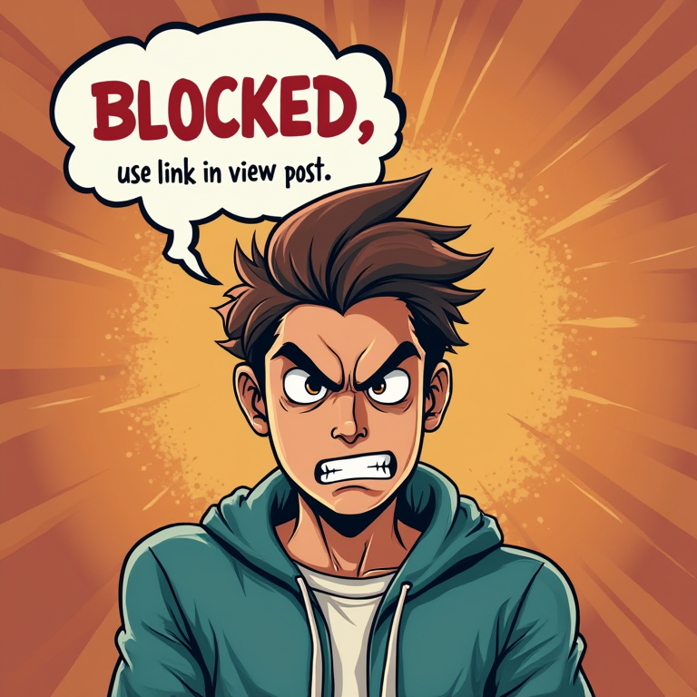
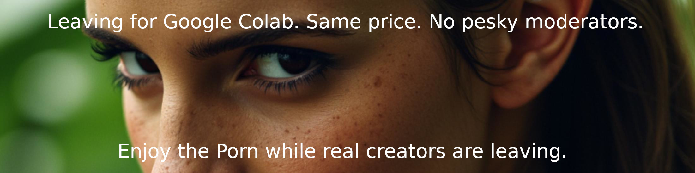
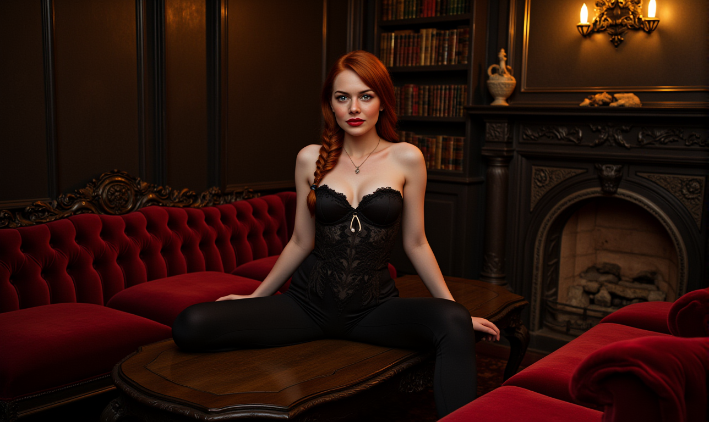
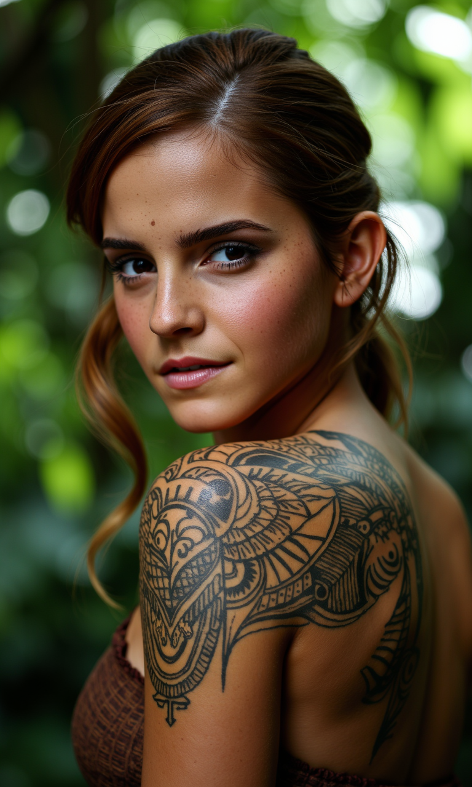

# Blocked on CivitAI



 A section that shows some of the most rediculous effects of CivitAI censoring.
 Below you can see that these are not images that deserve the attention of the moderators.
 I think the whole process is fundamentally flawed.
 
 I will now post the block image above. On the post I will link to the original blocked image. Here I will keep track on all zaleous attempts to block my images.
 
 UPDATE: I just posted my last appeal. Here the text:
 

```

My images (especially these ones) hardly ever exceed a PG rating. I am well aware that CivitAI is a technical community and not like f.i. DeviantArt one of artists. But when the most innocent images get blocked due to a flawed moderation system and/or overzalous moderators I think its my duty to speak up. 

I say flawed system becouse it takes quite some effort for people to find out why they are being blocked and how to appeal a decision. Thats wrong. It instills fear in people and obviously has repercusions for the quality of works you see on CivitAI.

Admittingly that I have no idea about the backend moderation, the resonse given are making me extremely suspicious that its mostly automated and reacting to flags. F.i. my posting 5488689 that was blocked for 'Female swimwear/underwear' . I don't know if I should cry or lol.  And then my post 5465241 blocked for Sexy Attire. How is that even a category?

From now on I will post a blocked image with a link to my work when these blocks occur. Being 65 I am a responssible CivitAI member even with my ADHD. I respect rules, but I will signal if they go to far.
```

And I got a lightning fast answer fom CivitAI

```
We are very stricit on Civitai when it comes to the portraying of real people. You can read more about it on this page: [https://civitai.com/safety](https://civitai.com/safety)

Most relevant paragraph would probably be this:

"Clothing: No low-cut shirts/dresses, short skirts or anything that wouldn't pass a conservative high school dress code. Think, "Would I wear this to a professional job interview?" If not, it's best to refrain."

```

So thats it. CivitAI explains my blocks with a "conservative high school dress code". I call BS. Just look at all the celebrity LoRa's they have and the images there. 

UPDATE:  
After my creative solution I thought would be beneficial to both parties I got

I dont give warning myself so action was taken

Goodbye CivitAI , my subscription now goes to [Google Colab](https://colab.research.google.com/signup)

| Subject | Block Reason | Post | Remarks |
| ------- | ------------ | ---- | ------- |
|| Female swimwear/underwear |5488689||
|| Sexy Attire |5465241||
|| Mature |5488004||
|| Mature | 5337526 | [Restored](https://civitai.com/images/23969735) |

