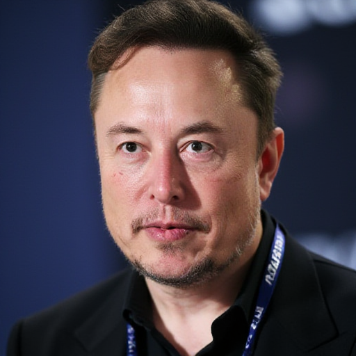

# FLUX

[Return to Index](/) | 

## Lora's

| Title | Description | Examples |
| ----- | ----------- | -------- |
| [Elon Musk](FLUX.Elon.Musk.safetensors) |Elon Musk, a man striving to become more hated then Donald Trump. |{: width="50%"}|
| [Hunger](FLUX.Hunger.safetensors) |After I noticed FLUX is not fond if negative setting I created this LoRa to be used for instance in creating artwork to expose bilionaires. |{: width="50%"}|
| [Liar in Chief](FLUX.Liar.In.Chief.safetensors) |He earned this title, vote blue!|{: width="50%"}|
| [Super Bigote](FLUX.SuperBigote.safetensors) |Maduro is a dictator surviving by the help of other dictators|{: width="50%"}|
| [Kamala Harris](https://ko-fi.com/s/c7f7b3970b) |Center Left almost conservative. Maybe whats needed. Vote blue.|{: width="50%"}|
| [The Fat One](FLUX.The.Fat.One.safetensors) |Another dictator. They call Kim 'The Fat One' behind his back. |{: width="50%"}|
| [Greta Tunberg](FLUX.Greta.Thunberg.safetensors)|Greta is an example an a Gen-Z hero.|{: width="50%"}|
| [Volodymyr Zelenskyy](FLUX.Volodymyr.Zelenskyy.safetensors) |A charismatic leader that will go into history. Slava Ukraina|{: width="50%"}|

## Comfy Workflows

coming soon.
