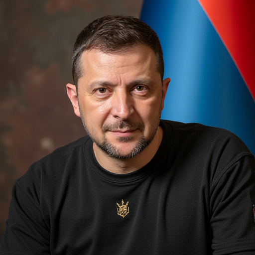
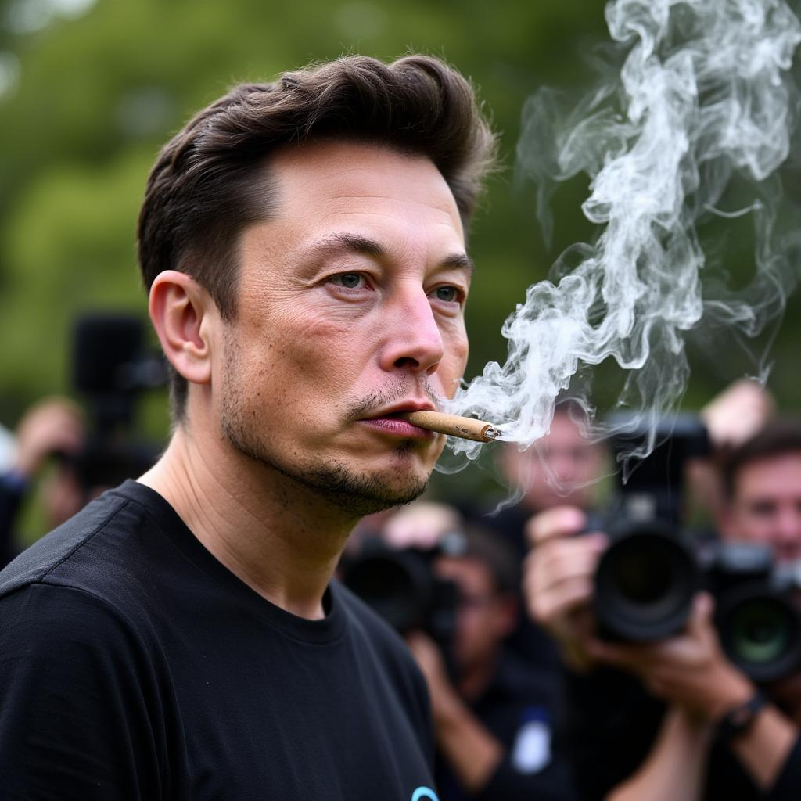
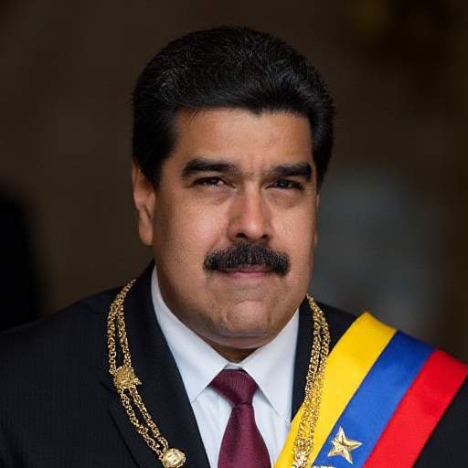
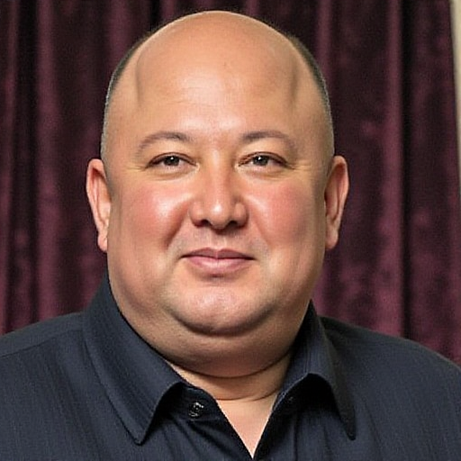
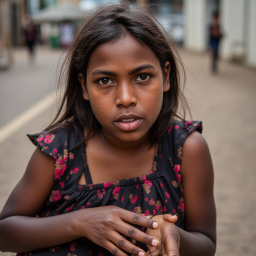

# FLUX

[Return to Index](/) | 

## Lora's

### Good people

| Title | Description | Examples |
| ----- | ----------- | -------- |
| [Kamala Harris](https://ko-fi.com/s/c7f7b3970b) |Center Left almost conservative. Maybe whats needed. Vote blue.|{: width="50%"}|
| [Greta Tunberg](https://ko-fi.com/s/bc381b6396)|Greta is an example an a Gen-Z hero.|{: width="50%"}|
| [Volodymyr Zelenskyy](https://huggingface.co/roelfrenkema/flux1.lora.zelenskyy) |A charismatic leader that will go into history. Slava Ukraina [https://en.wikipedia.org/wiki/Volodymyr_Zelenskyy](https://en.wikipedia.org/wiki/Volodymyr_Zelenskyy)|{: width="50%"}|

### Bad people

| Title | Description | Examples |
| ----- | ----------- | -------- |
| [Donald Trump](https://huggingface.co/roelfrenkema/flux1.lora.donaldtrump) | Wannabee buisnesman and dictator [https://en.wikipedia.org/wiki/Donald_Trump](https://en.wikipedia.org/wiki/Donald_Trump)|{: width="50%"}|
| [Geert Wilders](https://huggingface.co/roelfrenkema/flux1.lora.geertwilders)| Geert Wilders. [https://en.wikipedia.org/wiki/Geert_Wilders](https://en.wikipedia.org/wiki/Geert_Wilders)|{: width="50%"}|
| [Elon Musk](https://huggingface.co/roelfrenkema/flux1.lora.elonmusk) |Elon Musk, a man striving to become more hated then Donald Trump. [https://en.wikipedia.org/wiki/Elon_Musk](https://en.wikipedia.org/wiki/Elon_Musk)|{: width="50%"}|
| [Super Bigote](https://ko-fi.com/s/8f3389f132) |Maduro is a dictator surviving by the help of other dictators|{: width="50%"}|
| [The Fat One](https://ko-fi.com/s/77e9a4f783) |Another dictator. They call Kim 'The Fat One' behind his back. |{: width="50%"}|

### Concepts

| Title | Description | Examples |
| ----- | ----------- | -------- |
| [Hunger](https://ko-fi.com/s/9eed5d891d) |After I noticed FLUX is not fond if negative setting I created this LoRa to be used for instance in creating artwork to expose bilionaires. |{: width="50%"}|

## Comfy Workflows

coming soon.
