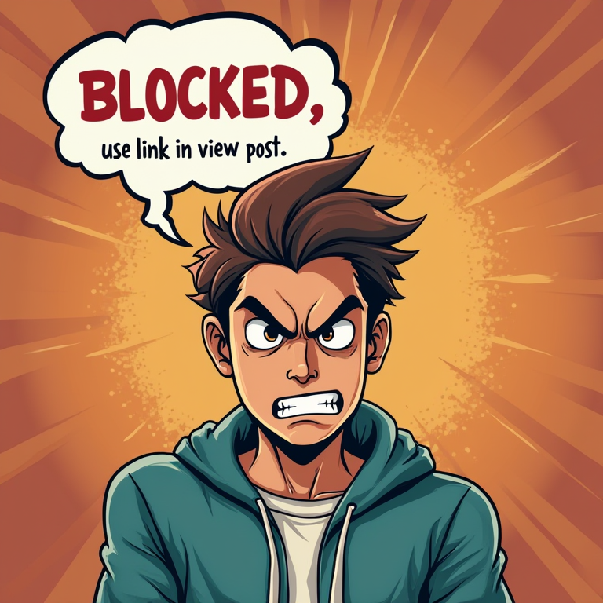

# Blocked on CivitAI

 A section that shows some of the most rediculous effects of CivitAI censoring. It seems I drew the wrath of some infantiles who are now stalking me and report each single image I place.
 
 Below you can see that these are not images that deserve the attention of the moderators. I wonder how long it will take for them to put 1 and 1 together and see a pattern?
 
 I was happy to see that after apealing the Emma Watson picture that I really like was restored. But because I think the whole process is fundamentally flawed I decided to no longer appeal and use this as a form of protest instead.
 
| Subject | Block Reason | Post | Remarks |
| ------- | ------------ | ---- | ------- |
|| Female swimwear/underwear |5488689||
|| Sexy Attire |5465241||
|| Mature |5488004||
|| Mature | 5337526 | RESTORED |

